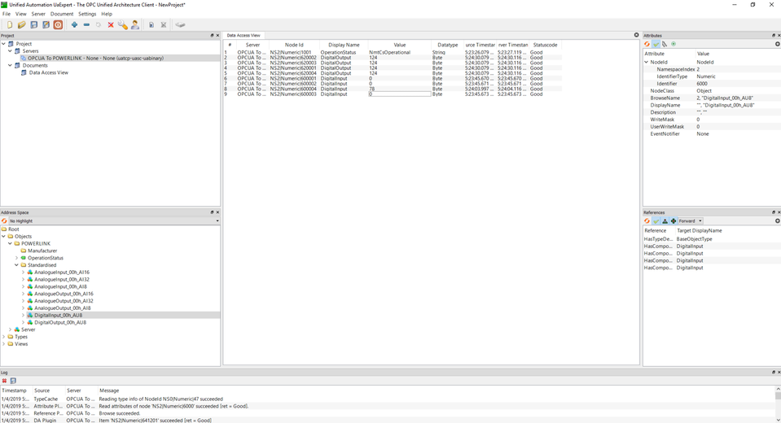

# opcua2powerlink

opcua2powerlink is an open source gateway using OPC UA (OPC Unified Architecture) and the industrial real-time fieldbus protocol POWERLINK for data communication from OT (operation technology) to IT (information technology)
The program is usable with all major compilers and provides necessary tools for a fast development process. Currently it is planned that the tool will support both Windows and Linux operation systems.
In the first version only the Windows version is available, the linux version will be available within the next 2 weeks.

opcua2powerlink is based on the open source free implementation of the OPC UA open62541 library (http://open62541.org) and the open source implementation of POWERLINK (http://openpowerlink.sourceforge.net/web/).

## Project Information

### Dependencies

- [open62541](http://open62541.org) OPC UA library
- [openPOWERLINK](http://openpowerlink.sourceforge.net/web/) stack
- Building and Code Generation: The build environment is generated via CMake. Some code and files are auot-generated. The code generation scripts run with both Python 2 and 3.

### Features

- Out of the Box dynamic OPC UA to POWERLINK gateway solution, Creates the required configuration and source files based on the POWERLINK device description file (xdd) during CMake
* Automatically creation of OPC UA nodeset.xml file based on POWERLINK device description file (xdd) during CMake
* Automatically creation of POWERLINK objdict.h file based on xdd file during CMake
* Automatically creation of source files for creating the OPC UA Server with tags from the xdd file during CMake
* Fully functional openPOWERLINK Slave (CN) device

### Requirements

* An POWERLINK master ([openPOWERLINK](http://openpowerlink.sourceforge.net/web/), [B&R](https://www.br-automation.com/),...) is required for controlling the  opcua2powerlink slave device
* An OPC UA Client program is required for connecting to the OPC UA Server

### Documentation and Support

A general introduction to OPC UA and the open62541 documentation can be found at http://open62541.org/doc/current also the general introduction to POWERLINK and the stack documentation can be found at http://openpowerlink.sourceforge.net/web/

For discussion and support the following channel is available:

- the [issues](https://github.com/emersbergerl/opcua2powerlink/issues)

## CMake Configuration Options

If you would like to change the configuration options you have to provide the configuration options on the command line (-DCFG_XXX=XXX) or call CMake in an interactive mode.

#### Windows Configuration Options

* __OPCUA_NAMESPACE__

	Defines the OPC UA namespace name which the gateway should use. Default name is 
	(http://opcua2powerlink.org/demo/)

* __XDD__
	
	Select the POWERLINK device description file (xdd) which should be used. The xdd file describes the Input's and Output's which are available for the device via POWERLINK.
	The project contains the [default xdd file](https://github.com/emersbergerl/opcua2powerlink/master/common/objdicts/CiA401_CN/00000000_POWERLINK_CiA401_CN.xdd) used by the openPOWERLINK stack. 
	
* __PYTHON_EXECUTABLE__
	
	Path to the python executable which should be used for the project.

#### Linux Configuration Options
* __Not implemented yet!__

## InProgress
* __Improve Documentation__
* __Linux support__
* __Enhance functionality__

## Examples

Overview of the default tags available via OPC UA from the opcua2powerlink tool.
Some of the values are written by an POWERLINK master and forwarded to the OPC UA Server.

